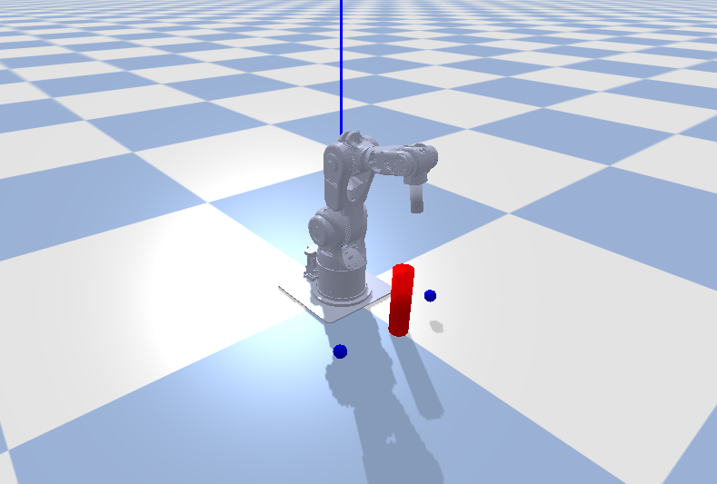

## Arm-Robotics-RL

#### Use Reinforcement Learning to train a robotic arm to hit ring bells

- Information about our robot

  The urdf is in the arm_env and meshes are in the probot_description

- Algorithm

  TD3, A3C(coming soon)

- Goal

  Take turns ringing the bells around the red pillar and avoid touching the red pillar obstacle

- Train
  
  python3 hit_learn.py
 
- Visualization

  tensorboard logdir log

  
